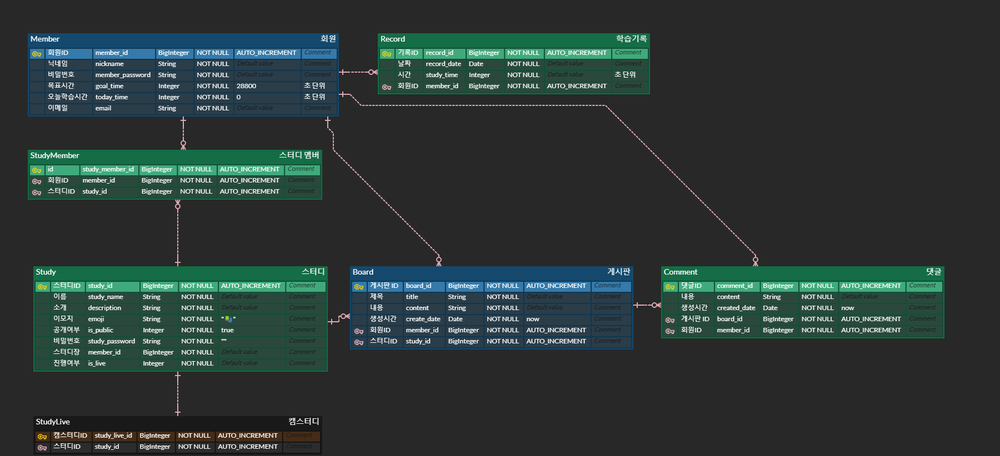

## 설정

```
git clone https://github.com/Ureca-Camster/Camster-BE.git
```

`git clone` 후 `build.gradle` 파일을 refresh 한다.<br>
`application.properties` 파일에서 데이터베이스 username과 password를 알맞게 설정한다.


## ERD Preview

